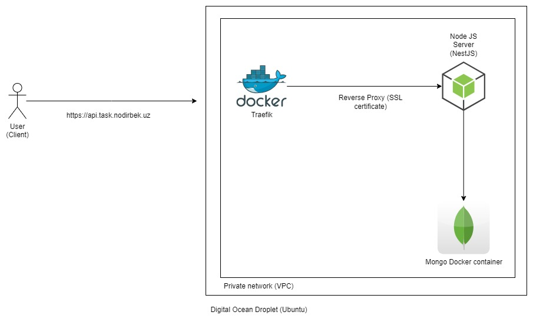

# Task management

Backend service to store user task with weather information. Weather integrated with [openweathermap.org](https://openweathermap.org/)

## Technology

Backend: NestJS

ODM: Mongoose

Database: MongoDB

Server: Digital Ocean

Deployment: Docker

Pipeline: Github Actions

Swagger

```
http://localhost:3000/api
```

## Sample user

E-mail

```
user@mail.com
```

Password

```
password
```

## Run project locally

1. Create .env file by copying content of .env.example

```
cp .env.example .env
```

2. Update WEATHER_API variable with real API key from [openweathermap.org](https://openweathermap.org/)

3. Run following command (Docker program should be running in locally. Port 3000 and 27017 should not busy)

```
docker compose up -d --build
```

4. Go to Swagger UI:

```
http://localhost:3000/api
```

## Stop project locally

1. Run following command

```
docker compose down
```

## Architecture


